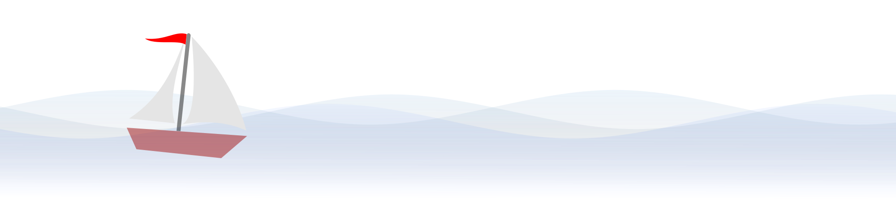
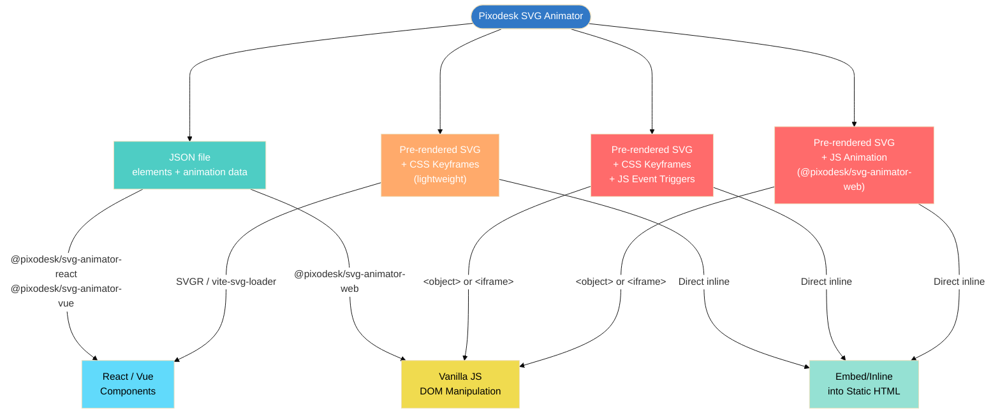

# pixodesk-svg-animator

[](https://github.com/pixodesk/pixodesk-svg-animator/actions/workflows/ci.yml)
[](https://opensource.org/licenses/MIT)

# 🚧 **Status - This project is currently under development.**


<!-- <video  src="boat.mp4" autoplay  muted loop playsinline style="width: 100%; height: auto; display: block;"></video> -->


This repository contains the official runtime libraries for playing SVG animations created with the [Pixodesk SVG Animation](https://pixodesk.com) editor.

**Common use cases:** 
- splash screens, 
- animated backgrounds, 
- icon animations, 
- loaders.


---

## Packages

| Package | Description |
|---------|-------------|
| **[@pixodesk/svg-animator-core](packages/svg-animator-core/README.md)** | Platform-neutral core — schema, document types, interpolation, effect materialisers and path sampling. No DOM. Shared by every player; you only depend on it directly to inspect or transform documents. |
| **[@pixodesk/svg-animator-web](packages/svg-animator-web/README.md)** | Web player — renders JSON animations in the browser via the Web Animations API or `requestAnimationFrame`. Ships as ESM, CJS, and UMD. |
| **[@pixodesk/svg-animator-react](packages/svg-animator-react/README.md)** | React component — SSR-safe wrapper around the web player |
| **[@pixodesk/svg-animator-vue](packages/svg-animator-vue/README.md)** | Vue component — SSR-safe wrapper around the web player |
| **[@pixodesk/svg-animator-rn](packages/svg-animator-rn/README.md)** 🧪 | **Experimental** — React Native player built on `react-native-svg` + `react-native-reanimated`. Component API mirrors the React package. See its README for the current feature gaps. |

How they fit together:

```
                    svg-animator-core          (schema · materialisers · sampling — no DOM)
                       ↑              ↑
        svg-animator-web        svg-animator-rn 🧪   (react-native-svg + reanimated)
          ↑          ↑
  -react       -vue
```

The same document format feeds every player: the core flattens effects, loops and
motion paths once, and each player renders the result its own way.

## Examples

Examples in [`examples/`](examples/):

| Example | Package | Run |
|---------|---------|-----|
| [web](examples/web/) | `@pixodesk/svg-animator-web` | `pnpm example:web` |
| [react](examples/react/) | `@pixodesk/svg-animator-react` | `pnpm example:react` |
| [vue](examples/vue/) | `@pixodesk/svg-animator-vue` | `pnpm example:vue` |
| [preview-player](examples/preview-player/) | web / react / vue side by side | `pnpm example:preview` |
| [react-native-preview-player](examples/react-native-preview-player/) 🧪 | `@pixodesk/svg-animator-rn` | `pnpm example:rn` |
| [react-native-feature-explorer](examples/react-native-feature-explorer/) 🧪 | `@pixodesk/svg-animator-rn` — all 118 feature fixtures | `pnpm example:rn:explorer` |

---

## File Formats created by [Pixodesk SVG Animation](https://pixodesk.com) editor

The Pixodesk editor supports animation in two formats: **Pre-rendered SVG** and **JSON**.   
Those file formats are interchangeable — the editor can convert between them at any time.

## Pixodesk SVG Animator File Formats at a Glance

Two export formats:

- **JSON file** — the most flexible format. Animation data, structure, and metadata in a single file; JavaScript renders the DOM and drives the animation at runtime. Use with `@pixodesk/svg-animator-web`, `@pixodesk/svg-animator-react`, `@pixodesk/svg-animator-vue`.
- **Pre-rendered SVG file** — animation embedded directly in the file. Self-contained. Three flavors:
  - **Pre-rendered SVG + CSS-Keyframes** — animation defined in a `<style>` block
    - *No `<script>` tag* — zero JavaScript
    - *With JS triggers* — adds a minimal `<script>` fragment to respond to events (click, hover, scroll)
  - **Pre-rendered SVG + JavaScript animation** — `@pixodesk/svg-animator-web` bundled inside a `<script>` tag. Supports:
    - Web Animations API (WAAPI) — native browser animation
    - Animation frames (`requestAnimationFrame`) — universal browser support

---




## How to Choose Pixodesk SVG Animator File Format - JSON vs Pre-rendered SVG

**Default to JSON.** Switch to **Pre-rendered SVG** (which has some limitations) when you want to:
- **Reduce bundle size** — use CSS Keyframes for simple animations; no JavaScript library needed
- **Show content before JavaScript loads for static site generators** — the SVG is rendered ahead of time and visible immediately
- **Minimize setup** — just inline/embed the file directly without extra setup

**More details**:

- **React / Vue / Next.js / Nuxt**
  - Use **JSON** — **SSR-safe**, integrates cleanly with framework components, avoids inline script restrictions. Full support of animation features. Use `@pixodesk/svg-animator-react` / `@pixodesk/svg-animator-vue`.
  - Use **Pre-rendered SVG + CSS-Keyframes** (no JavaScript) — minimal setup; import the same way as SVG icons (e.g., via **SVGR** or **vite-svg-loader**), and it is **SSR-safe**. It has limitations in what it can animate and offers less control over animation behavior. However, it is sufficient for most use cases.
- **Vanilla JavaScript/DOM**, dynamic load.
  - Use **JSON** — dynamically load and instantiate an animator using `@pixodesk/svg-animator-web`. Full support of animation features.
  - Use **Pre-rendered SVG** — with `<object data="animation.svg" ...` or `<iframe src="animation.svg" ...`. Not recommended.
- **Static site generators and CMS** (Astro, Jekyll, WordPress, Shopify, etc.)
  - Use **any Pre-rendered SVG** — the build tool or CMS inlines the file at build time; even an SVG with `<script>` tags will just work


### Format pros and cons

| File type | When to use | Advantages | Disadvantages |
|-----------|-------------|------------|---------------|
| **JSON file** | Complex animations (shape morph, sequencing) <br> Programmatic control needed <br> Multiple instances on the page <br> React / Vue / Next.js / Nuxt apps | Full animation support including all types <br> Fine-grained runtime control: play, pause, seek, reverse, speed <br> Clean independent rendering per instance — no ID conflicts <br> SSR-safe | Requires `@pixodesk/svg-animator-react`, `-vue`, or `-web` runtime <br> More setup: data file and rendering component must be wired together |
| **Pre-rendered SVG** with <br> **CSS Keyframes** | Drop-in animated icon in React/Vue <br> Embedding via `` or inline HTML <br> Simple looping or entrance animations | No library payload — minimal file size <br> No `<script>` tag — embeds cleanly via ``, inline HTML, or SVGR <br> Works as a drop-in icon replacement | Limited to what CSS `@keyframes` can express (see [Animation Type Support](#animation-type-support)) <br> Shape morphing only in Chrome/FF/Edge, same-structure paths <br> No runtime control (play, pause, seek) <br> Possible ID conflicts when the same SVG is embedded more than once |
| **Pre-rendered SVG** with <br> **CSS Keyframes + JS triggers** | Static HTML pages with event-triggered start/stop (e.g. play on hover) | No library payload — minimal file size <br> Adds basic event-driven start/stop control | Same CSS `@keyframes` limits as above <br> No precise runtime control (seek, reverse, speed) <br> `<script>` tag prevents embedding via SVGR or `` <br> Possible ID conflicts when the same SVG is embedded more than once |
| **Pre-rendered SVG** with <br> **JavaScript animation** | Static or server-rendered pages <br> When content must appear before JS hydration <br> All animation types without a separate data file | Supports all animation types including shape morphing <br> Full runtime control: play, pause, seek, reverse, speed <br> Self-contained — no separate data file required | Adds `@pixodesk/svg-animator-web` library overhead <br> `<script>` tag prevents embedding via SVGR or `` <br> Possible ID conflicts when the same SVG is embedded more than once |

---

## Animation Type Support

With `mode: 'auto'` (the default) the player picks the Web Animations API and **automatically falls back to the frames engine** whenever a document animates something WAAPI can't express — so from the user's point of view every row below "just works" in the JSON format; the columns describe *which* mechanism drives it.

| Animation Type | CSS Keyframes | Web Animation API <br> (JavaScript) | Animation Frames <br> (JavaScript) |
|----------------|---------------|--------------------------------------|-------------------------------------|
| **Simple Numeric** (opacity, stroke-width) | ✅ Full support | ✅ Full support | ✅ Full support |
| **Position Attributes** (x, y, cx, cy, r, rx, ry) | ✅ Full support ¹ | ✅ Full support ¹ ² | ✅ Full support |
| **Size Attributes** (width, height) | ✅ Full support ¹ | ✅ Full support ¹ ² | ✅ Full support |
| **Transform** (translate, rotate, scale, skew) | ✅ Full support | ✅ Full support | ✅ Full support |
| **Colors** (fill, stroke) | ✅ Full support | ✅ Full support | ✅ Full support |
| **Path Morphing** (d attribute) | ⚠️ Chrome/FF/Edge ³ | ❌ Falls back to frames ² | ✅ Full support |
| **Stroke Dash** (stroke-dasharray, stroke-dashoffset) | ✅ Full support | ✅ Full support | ✅ Full support |
| **Gradient Stop Points** (offset, stop-color) | ⚠️ stop-color only ⁴ | ❌ Falls back to frames ² | ✅ Full support |
| **Filters** (blur, brightness, etc.) | ❌ Not supported | ❌ Falls back to frames ² | ✅ Full support |
| **Clip-path / Mask Morphing** | ❌ Not supported | ❌ Falls back to frames ² | ✅ Full support |
| **Text on Path** (startOffset, textPath) | ❌ Not supported ⁵ | ❌ Falls back to frames ² | ✅ Full support |
| **Performance** | ⚡ Excellent | ⚡ Excellent | ⚠️ Good |
| **Browser Support** | ✅ Universal | ✅ Modern browsers | ✅ Universal |

¹ SVG geometry as CSS properties (`x`, `cy`, `r`, `width`, …) works in Chromium/WebKit; **Firefox does not implement it** — use the JSON format (auto frames fallback) for guaranteed cross-browser geometry animation.
² The player gates each attribute with `CSS.supports(...)` at runtime; if anything in the document isn't natively animatable, the whole document automatically switches to the frames engine (`mode: 'auto'`). The animation still plays — just not via native WAAPI.
³ CSS `d: path(...)` morphing requires identical path command structure across keyframes and is unavailable in Safari < 18.5.
⁴ Per-`<stop>` `stop-color` animates via CSS; stop **`offset`** and gradient **geometry** cannot be expressed in CSS at all — the player animates both via the frames engine (`effects.fillGradient.animate`).
⁵ The static `<textPath>` layout renders everywhere; it is the *animation* of `startOffset`/`textLength` that CSS cannot express.


---


## File formats


#### JSON format schema reference

```typescript
// PxPropertyAnimation — single-property animation
interface ANIMATE {
    keyframes?: Array<{                       // alias: kfs
        time?: number;                        // ms offset; alias: t
        value?: any;                          // see "Keyframe values" below; alias: v
        easing?: string | [number, number, number, number]; // named ref or cubic-bezier; alias: e
        tangentOut?: [number, number];        // motion-path delta tangent at this kf; alias: to
        tangentIn?:  [number, number];        // motion-path delta tangent at this kf; alias: ti
        selected?:  boolean;                  // editor-only UI state; accepted on the wire, ignored by the player
    }>;
    kfs?: Array<…>;                           // alias for `keyframes`
    autoOrient?: boolean;                     // translate-only: rotate element to face the path tangent
    // pre-processes keyframes to fill animator.duration by repeating a segment
    // true → default: repeat last segment, cycling forward
    // independent of animator.iterations; composes as loop-within-loop
    loop?: boolean | {
        segmentCount?: number;           // intervals forming the segment; undefined = whole sequence; clamped [1, n-1]
        extend?: 'before' | 'after';     // which END the loop fills: 'after' (default, absent) = idle/outro,
                                         // 'before' = intro. Was the boolean `before` until 2026-08.
        alternate?: boolean;             // false (default) = cycle same direction; true = pingpong
    };
}
```

**Use one spelling per key, never both.** The short forms (`kfs`, `t`, `v`, `e`,
`to`, `ti`) are aliases of the long ones. If both are present the result is not
well-defined — `v`/`e` prefer the short form, `tangentIn`/`tangentOut` prefer the
long one, and `kfs` vs `keyframes` differs between code paths.

**Keyframe values** — the shape depends on the property being animated:

| Property kind | `value` shape | Example |
|---|---|---|
| Scalar (`opacity`, `rotate`, `r`, `stroke-width`, …) | `number` | `0.5` |
| Vector (`translate`, `scale`, `stroke-dasharray`) | `Array<number>` | `[80, 40]` |
| Colour (`fill`, `stroke`, `stop-color`, …) | `string` or RGBA array | `"#ec4899"` |
| Unified `transform` | parts record | `{ translate:[8,4], rotate:90, skew:10, scale:[2,2], origin:[5,5] }` |
| Path (`d`) | `{ path: "M…" }` | one `d` string; compound shapes use several `M…` sub-paths |

For `d`, the legacy `{ paths: [ …bezier objects… ] }` form is also accepted, as are
bare `"M…"` strings and CSS `path("M…")` wrappers — all normalise to the same
internal representation. Both keyframes of a morph must have the same command
structure.

**Any attribute takes one of three forms**, consistently across the format:

```js
{ fill: '#3b82f6' }                              // 1. primitive — static
{ transform: { value: { translate: [10, 10] } } }// 2. {value} — structured static
{ opacity: { keyframes: [ … ] } }                // 3. {keyframes} — animated
```

**Unified `transform`** — animate the parts together as a single property whose `value` is a parts record:

```js
animate: { transform: { keyframes: [
  { time: 0,    value: { translate: [0, 0],   rotate: 0,  scale: [1, 1] } },
  { time: 1000, value: { translate: [80, 40], rotate: 90, scale: [1.5, 1.5] } }
] } }
```

| Part | Type | Notes |
|---|---|---|
| `translate` | `[x, y]` | user units |
| `rotate` | `number` | degrees |
| `skew` | `number` | skewX in degrees; composed between `rotate` and `scale` (Lottie order) |
| `scale` | `[sx, sy]` | |
| `origin` | `[x, y]` | pivot for rotate / skew / scale — only meaningful alongside one of them |

Composed order: `translate · +origin · rotate · skewX · scale · −origin`.

The legacy per-key form (`animate: { translate, rotate, scale }` — used in the examples below) is still accepted; both produce the same composed `transform` string at render. A static `transform` attribute and an animated transform part **cannot sit on the same node** — they occupy the same slot, so the animation wins. Put the static part on a wrapping `<g>`.

```typescript
// PxAnimatedSvgDocument
// Mode A: has children — player renders SVG tree and animates it
// Mode B: no children — player animates a pre-existing SVG DOM via animator.animateById
interface SVG_JSON {
    type: 'svg';        // document root marker
    id?: string;        // DOM id; in Mode B used to locate the pre-rendered element
    viewBox?: string;   // internal coordinate space, e.g. "0 0 700 380"
    width?: number;     // rendered size; width accepts CSS units
    height?: number;
    [key: string]: any; // any SVG/CSS presentation attribute; pass-through to DOM

    animator?: {
        delay?: number;                    // delay before start, ms (default 0); negative = seek into the timeline
        duration?: number;                 // length of ONE iteration, ms (default 1000); keyframe t values are absolute offsets
        iterations?: number | 'infinite'; // repeat count (default 1); composes with per-property loop (loop-within-loop)
        fill?: 'forwards' | 'backwards' | 'both' | 'none'; // WAAPI fill; default 'forwards' holds final state
        direction?: 'normal' | 'reverse' | 'alternate' | 'alternate-reverse'; // default 'normal'
        mode?: 'auto' | 'waapi' | 'frames'; // default 'auto' = WAAPI→RAF fallback; 'waapi' = WAAPI; 'frames' = RAF
        frameRate?: number;                // target fps; RAF mode only (default: uncapped)
        resetOnFinish?: boolean;           // default false; after a NATURAL finish, snap back to the start state

        trigger?: {
            startOn?: 'load' | 'mouseOver' | 'click' | 'scrollIntoView' | 'programmatic';
            outAction?: 'continue' | 'pause' | 'reset' | 'reverse'; // default 'continue'
            scrollIntoViewThreshold?: number; // visibility fraction 0–1, default 0 (any pixel); scrollIntoView only
        };

        // named reusable easings and animations; resolved at runtime
        // materialise (inline) all refs before handing to a dumb player
        definitions?: {
            easings?: Record<string, [number, number, number, number]>; // name → [x1,y1,x2,y2]
            animations?: Record<string, Record<string, ANIMATE>>;       // name → { propName: ANIMATE }
            styles?: Record<string, Record<string, string | number>>;   // name → style preset (node.style may reference by name)
            // font-family → embedded glyph outlines, for glyph-mode text
            // (effects.text.useGlyphs) — renders without shipping a font
            glyphs?: Record<string, {
                fFamily: string;      // e.g. "Roboto"
                style: string;        // "" | "italic" | …
                ascent: number;       // in unitsPerEm
                unitsPerEm: number;   // e.g. 1000
                glyphs: Record<string, { width: number; d: string }>;  // keyed by the character
            }>;
        };

        timeline?: 'time' | 'scroll'; // clock that drives playback; default (and today's only
                                 // implemented value) 'time' — omitted from the wire when default.
                                 // 'scroll' is reserved: scroll-linked playback is coming.
        debugInstName?: string;  // exposes the animator as window[debugInstName]

        // Mode B — maps elementId → animation spec. Same value type as `node.animate`;
        // only the KEYSPACE differs (element id here, attr name there), which is what
        // the `ById` suffix names. Was `animate` before 2026-08.
        animateById?: Record<string,
            | string
            | Array<string>
            | Record<string, ANIMATE>
            | Array<string | Record<string, ANIMATE>>
        >;
    };

    // Mode A — SVG element tree; absence of children signals Mode B
    children?: Array<{
        type: string;       // SVG element tag: "rect", "g", "path", "ellipse", "use", …
        id?: string;        // DOM id; required for href="#id" refs or animator.animateById targeting
        [key: string]: any; // SVG/CSS attrs (cx, cy, r, fill, stroke, transform, …); pass-through
        text?: string;      // text content for <text>/<tspan> (alias: textContent)
        style?: string | Record<string, string | number>;
        // named ref / array of refs / inline definition / mixed array
        animate?: string | Array<string> | Record<string, ANIMATE> | Array<string | Record<string, ANIMATE>>;
        // Player-materialised structural effects (transformBy/repeater/maskedBy/
        // strokeTrim/clone/gradient/textPath/text/isCombinedShape). JSON-only — the
        // Pre-rendered SVG export materialises these in the Editor. See "Player
        // effects" section below.
        effects?: {
            // each part is animatable: raw value | {value} | {keyframes}
            transformBy?:     { translate?: [x,y], rotate?: deg, skew?: deg, scale?: [x,y], origin?: [x,y] };
            repeater?:        { copies?: number, translate?: [x,y], rotate?: deg, scale?: [%,%], origin?: [x,y] };
            maskedBy?:        { sourceId?: string, maskType?: 'alpha' | 'luminance',
                                maskUnits?, maskContentUnits?: 'userSpaceOnUse' | 'objectBoundingBox',
                                x?, y?, width?, height?: number };   // mask viewport, user units
            clipPath?:        { d?: string, animate?: ANIMATE };   // static `d`, or animated clip geometry
            strokeTrim?:        { offset?: number, range?: [a,b], subPaths?: 'separate' | 'combined' };  // offset/range animatable
            clone?:           { type?: 'content', sourceId?: string,
                                retime?: { start?, stretch?: number, timeCrop?: [inMs, outMs] } };
            // `animate` = animated geometry: gradientX1/Y1/X2/Y2 (linear),
            // gradientCx/Cy/Fx/Fy/R (radial). Frames engine only.
            fillGradient?:    { type: 'linear'|'radial', p1?, p2?, c?, r?, fp?, stops?, animate?, gradientUnits?, spreadMethod?, gradientTransform? };
            strokeGradient?:  { /* same shape as fillGradient */ };
            textPath?:        { path: string, pathOverflow?, lengthAdjust?, method?, spacing?, startOffset?, textLength? };
            text?:            { useGlyphs?: boolean };  // render text from embedded glyph outlines (definitions.glyphs)
            isCombinedShape?: boolean;
        };
        meta?: any;         // editor-only (label, shape, …); not rendered, ignored by player
        children?: Array<any>; // recursive; <g>, <defs>, <symbol>, <text>, <use>, …
    }>;
}
```

Text content goes on the `textContent` attribute rather than in `children`:

```js
{ type: 'text', x: 20, y: 40, fill: '#111', 'font-size': 18, textContent: 'Hello' }
```

> `textContent` is the canonical key (it is the DOM property name). The older `text` spelling is
> still READ for compatibility, but never written — `text` was overloaded three ways: the `text`
> tag, the `effects.text` group, and the content itself.

**Reserved keys and the `domType` escape hatch.** `type` on a node is the SVG **tag name** — that is
what tells the player to build a `<rect>` rather than a `<circle>`. A few SVG elements also have a
real `type` *attribute* of their own (`<feTurbulence type="fractalNoise">`, `<feColorMatrix
type="saturate">`, `<style type="text/css">`, `<script>`, `<animateTransform>`). Writing that
attribute as `type` would overwrite the tag and destroy the element, so it ships as **`domType`**:

```js
// the DOM attribute `type="fractalNoise"` on an feTurbulence element
{ type: 'feTurbulence', domType: 'fractalNoise', baseFrequency: 0.05, numOctaves: 2 }
//     ^ the TAG                ^ the ATTRIBUTE
```

The player renames `domType` back to `type` when it writes the element, so the rendered SVG is
standard. The reserved wire keys — never written to the DOM as attributes — are exactly
`type` (the tag), `children`, `animator`, `animate`, `meta`, `text` and `textContent`
(`INTERNAL_ATTRS` in the core). `effects` is not in that list because it never survives that far:
`applyPlayerEffects` consumes it at load, so the renderer never sees it.

### JSON File format example

A JSON document that mirrors SVG structure. The player constructs the SVG DOM and drives the animation at runtime. All animation data, structure, and metadata live in one file.

Two modes share the same root document type (`PxAnimatedSvgDocument`):
- **Mode A** — `children` present: player renders the element tree and animates it.
- **Mode B** — no `children`: player animates a pre-existing SVG DOM via `animator.animateById`.

**Quick example:**

```json
{
  "type": "svg",
  "viewBox": "0 0 400 400",
  "animator": {
    "duration": 1000,
    "iterations": "infinite",
    "mode": "auto",
    "trigger": { "startOn": "load" }
  },
  "children": [
    {
      "type": "ellipse",
      "fill": "#007fff85",
      "stroke": "#003a73",
      "rx": 64, "ry": 64,
      "animate": {
        "translate": {
          "keyframes": [
            { "t": 0,    "v": [139, 163] },
            { "t": 1000, "v": [139, 310] }
          ]
        }
      }
    }
  ]
}
```

#### Full example — Mode A (all animation types)

```typescript
const doc = {
    type: 'svg',
    id: '_px_root',
    viewBox: '0 0 600 400',

    animator: {
        duration: 2000,
        iterations: 'infinite',
        fill: 'forwards',
        direction: 'alternate',
        mode: 'auto',
        trigger: { startOn: 'load', outAction: 'pause' },
        definitions: {
            easings: {
                'smooth': [0.42, 0, 0.58, 1],  // name → [x1,y1,x2,y2]
            },
            animations: {
                'fadeIn': { 
                    opacity: { keyframes: [{ time: 0, value: 0 }, { time: 2000, value: 1 }] } 
                },
            },
        },
    },

    children: [

        // opacity — number; named ref from definitions.animations
        {
            type: 'rect',
            x: 40, y: 40, width: 120, height: 90, rx: 8, fill: '#6366f1',
            animate: 'fadeIn',
        },

        // fill — color; inline keyframes with named easing ref
        {
            type: 'ellipse',
            cx: 260, cy: 95, rx: 80, ry: 55, fill: '#3b82f6',
            animate: {
                fill: {
                    keyframes: [
                        { time: 0,    value: '#3b82f6' },
                        { time: 2000, value: '#ec4899', easing: 'smooth' },
                    ],
                },
            },
        },

        // translate + scale + rotate
        // one CSS transform fn per nesting level — compose by nesting, not by listing
        {
            type: 'g',
            animate: { translate: { keyframes: [{ time: 0, value: [460, 90] }, { time: 2000, value: [540, 90] }] } },
            children: [{
                type: 'g',
                animate: {
                    scale: {
                        keyframes: [
                            { time: 0,    value: [1,   1  ] },
                            { time: 1000, value: [1.3, 1.3] },
                            { time: 2000, value: [1,   1  ] },
                        ],
                        loop: true,  // repeat last segment to fill animator.duration
                    },
                },
                children: [{
                    type: 'g',
                    animate: {
                        rotate: {
                            keyframes: [{ time: 0, value: 0 }, { time: 1000, value: 360 }],
                            loop: { segmentCount: 1, before: false, alternate: false },
                        },
                    },
                    children: [{ type: 'rect', x: -22, y: -22, width: 44, height: 44, fill: '#10b981' }],
                }],
            }],
        },

        // path morph — animate 'd'; both values must have identical command structure
        {
            type: 'path',
            fill: '#f59e0b',
            transform: 'translate(120, 280)',
            animate: {
                d: {
                    keyframes: [
                        { time: 0,    value: 'M-50,0 L0,-50 L50,0 L0,50 Z'       },
                        { time: 2000, value: 'M-50,-50 L50,-50 L50,50 L-50,50 Z' },
                    ],
                },
            },
        },

        // stroke-dasharray — draw-on effect; v is [dash, gap]
        {
            type: 'path',
            stroke: '#ef4444', 'stroke-width': 3, fill: 'none',
            d: 'M 240 260 C 320 180 400 340 480 260',
            animate: {
                'stroke-dasharray': {
                    keyframes: [
                        { time: 0,    value: [0,   300] },
                        { time: 2000, value: [300, 300] },
                    ],
                },
            },
        },
    ],
};
```


### Pre-rendered SVG File overview

A self-contained animated SVG — all shapes, styles, and animation logic are embedded directly in the file. No separate data file or rendering component is needed. Three flavors are available:

#### **Pre-rendered SVG + CSS Keyframes**

Animation defined in a `<style>` block. No JavaScript, no `<script>` tag.

```svg
<svg xmlns="http://www.w3.org/2000/svg" viewBox="...">
  <style>
    @keyframes _px_2s602utm {
      0% { transform: translate(200.1185px, 41.3612px); }
      100% { transform: translate(200.1185px, 41.3612px); }
    }
  </style>
  <g class="px-anim-element _px_2s602utn" transform="...">
    <ellipse id="_px_2s602utl" fill="#0087ff" ... />
  </g>
</svg>
```

#### **Pre-rendered SVG + CSS Keyframes + JavaScript triggers** 
Same as above, plus a small `<script>` fragment to start/stop the animation on events (click, hover, scroll).

```svg
<svg xmlns="http://www.w3.org/2000/svg" viewBox="...">
  <style>@keyframes ... { ... }</style>
  <g class="px-anim-element ...">...</g>
  <script data-px-script="true">
    /* Small fragment to control animation on events */
  </script>
</svg>
```

#### **Pre-rendered SVG + JavaScript animation (Mode B)**

Static SVG markup with `@pixodesk/svg-animator-web` bundled in a `<script>` tag. The player targets existing DOM elements by `id`. Supports all animation types including shape morphing. Uses WAAPI or `requestAnimationFrame`.

The `data` object passed to `createAnimator` is the same `PxAnimatedSvgDocument` type as the JSON format — without `children`. All animation config lives in `animator.definitions` (named easings and animations) and `animator.animateById` (element ID → animation spec map).

```xml
<!-- static markup; player targets elements by id -->
<svg id="_px_root" xmlns="http://www.w3.org/2000/svg" viewBox="0 0 600 400">

  <!-- opacity; starts transparent, animated to visible -->
  <rect id="_px_rect" x="30" y="30" width="120" height="80"
        rx="8" fill="#6366f1" opacity="0" />

  <!-- fill color + slide-in from left -->
  <ellipse id="_px_ellipse" cx="260" cy="70" rx="80" ry="50" fill="#3b82f6" />

  <!-- scale loop + translate; children at origin so scale-origin is correct -->
  <g id="_px_group" transform="translate(90,260)">
    <rect x="-40" y="-30" width="80" height="60" rx="6" fill="#a855f7" />
  </g>

  <!-- rotate loop; transform-box ensures rotation around own center -->
  <g id="_px_icon" transform="translate(260,260)"
     style="transform-box:fill-box;transform-origin:center">
    <rect x="-25" y="-25" width="50" height="50" rx="4" fill="#10b981" />
  </g>

  <!-- path morph; same command count/structure in both keyframe values -->
  <path id="_px_morph" fill="#ec4899" transform="translate(420,260)"
        d="M-50,0 L0,-50 L50,0 L0,50 Z" />

  <!-- draw-on; starts hidden via stroke-dasharray -->
  <path id="_px_path" stroke="#ef4444" stroke-width="3" fill="none"
        stroke-dasharray="0 300"
        d="M 30 360 C 130 290 230 420 330 350 C 430 280 530 390 570 340" />

  <script data-px-script="true">
    var a = PixodeskAnimator.createAnimator({ data: {
        type: 'svg',
        id: '_px_root',
        animator: {
            duration: 2000,
            iterations: 'infinite',
            fill: 'forwards',
            mode: 'auto',
            trigger: { startOn: 'load', outAction: 'pause' },
            definitions: {
                easings: {
                    'smooth': [0.42, 0, 0.58, 1],
                },
                animations: {
                    'fadeIn':     { 
                          opacity:            { keyframes: [
                              { time: 0, value: 0 }, 
                              { time: 2000, value: 1 }] } },
                    'colorShift': { 
                          fill:               { keyframes: [
                              { time: 0, value: '#3b82f6' }, 
                              { time: 2000, value: '#ec4899', easing: 'smooth' }] } },
                    'slideIn':    { 
                          translate:          { keyframes: [
                              { time: 0, value: [-80, 0] }, 
                              { time: 2000, value: [0, 0] }] } },
                    'pulse':      { 
                          scale:              { 
                              keyframes: [
                                  { time: 0, value: [1, 1] }, 
                                  { time: 1000, value: [1.2, 1.2] }, 
                                  { time: 2000, value: [1, 1] }
                              ], 
                              loop: true 
                          } 
                    },
                    'spin':       { 
                          rotate:             { 
                              keyframes: [{ time: 0, value: 0 }, { time: 1000, value: 360 }], 
                              loop: { segmentCount: 1, before: false, alternate: false } 
                    } },
                    'morph':      { d:                  { keyframes: [
                        { time: 0, value: 'M-50,0 L0,-50 L50,0 L0,50 Z' }, 
                        { time: 2000, value: 'M-50,-50 L50,-50 L50,50 L-50,50 Z' }] } },
                    'draw':       { 'stroke-dasharray': { keyframes: [
                        { time: 0, value: [0, 300] },
                        { time: 2000, value: [300, 300] }] 
                    } },
                },
            },
            animate: {
                _px_rect:    'fadeIn',                              // single named ref
                _px_ellipse: ['colorShift', 'slideIn'],             // array of refs
                _px_group:   ['pulse', { translate: { keyframes: [  // mixed
                    { time: 0, value: [0, 0] }, 
                    { time: 2000, value: [40, 0] }
                ] } }],
                _px_icon:    'spin',
                _px_morph:   'morph',
                _px_path:    'draw',
            },
        },
    }});
  </script>
</svg>
```

---

## Player effects (`node.effects`)

JSON-only. Each effect on `node.effects` is a structural expansion the
**Player materialises at runtime** (extra `<use>` copies, wrapping `<g>`s, etc.).
In the **Pre-rendered SVG** export the editor materialises the same effects ahead
of time, so the exported SVG already contains the expanded structure —
`node.effects` is absent.

```js
{ type: 'rect', id: '_px_r', x: 0, y: 0, width: 60, height: 60, fill: '#3b82f6',
  effects: { /* one or more of the below */ } }
```

| Effect | Payload | What it does |
|---|---|---|
| `transformBy` | `{ translate?:[x,y], rotate?:deg, skew?:deg, scale?:[x,y], origin?:[x,y] }` (each may be animated) | Wraps the element in transform `<g>`s; lets you keep `origin` semantics that the body `transform` string can't express. `skew` is a scalar (skewX degrees), composed between `rotate` and `scale`. |
| `repeater` | `{ copies:N, translate?:[x,y], rotate?:deg, scale?:[%, %], origin?:[x,y] }` (each may be animated) | Materialises `N` real copies of the element, each offset by its index (`translate`/`rotate`/`origin` × i, `scale` per-axis `(v/100)^i`). The base element and the per-copy params can both animate. |
| `maskedBy` | `{ sourceId:"#id", maskType?:"alpha"\|"luminance", maskUnits?, maskContentUnits?, x?, y?, width?, height? }` | Builds a `<mask>` from the referenced element and applies it to this one. `x`/`y`/`width`/`height` are the mask VIEWPORT in user units — content outside it is clipped; omit all four for the SVG default (`-10%,-10%,120%,120%`). A `0` is a real value, not "absent". |
| `clipPath` | `{ d?:"M…", animate?: ANIMATE }` | Generates a `<clipPath>` from the path data and sets `clip-path` on the host. `animate` is the property animation **itself** (`{keyframes:[…]}`), not `{d:{keyframes:[…]}}` — its keyframe values are `{path:"M…"}`. |
| `strokeTrim` | `{ offset?, range?:[a,b], subPaths?:"separate"\|"combined" }` (`offset`/`range` animatable) | Trims the visible stroke segment along a path. `subPaths` says what the 0..1 window is measured over: `"separate"` (default) trims each sub-path against its own length; `"combined"` chains all descendant sub-paths into one virtual path so the window slides across siblings (After Effects "Trim All As One"). |
| `clone` | `{ type?:"content", sourceId:"#id", retime?:{ start?:ms, stretch?:1.0, timeCrop?:[inMs,outMs] } }` | `<use>`-only. A `<use>` is a clone of something: `sourceId` = the source element id (says WHAT it clones), nested `retime` = optional time-shift of the source's internal timeline (says WHEN). `type:"content"` is a "no-ref-translate" content link — targets the source's content sub-anchor so the source's own outer translate isn't re-applied; `type` absent = direct whole-element link (keeps translate). `retime.timeCrop` clips the clone to a visibility window `[inMs, outMs]` on the DOCUMENT timeline — implemented as a wrapping `<g>` with an opacity gate. |
| `fillGradient` / `strokeGradient` | `{ type:"linear"\|"radial", p1?,p2? (linear) \| c?,r?,fp? (radial), stops?, animate?, gradientUnits?, spreadMethod?, gradientTransform? }` | Generates a `<linearGradient>`/`<radialGradient>` def and points the host's `fill`/`stroke` at it. `stops` is one timeline — static array, or `{keyframes}` whose each kf `value` is the full stops array snapshot. **`animate` animates the geometry** — `gradientX1/Y1/X2/Y2` (linear), `gradientCx/Cy/Fx/Fy/R` (radial); frames-engine only. `gradientTransform` is static-only. |
| `textPath` | `{ path:"M…", pathOverflow?, lengthAdjust?, method?, spacing?, startOffset?, textLength? }` | On a `<text>` host: generates a `<path>` def from the inline `path` and wraps the text's children in a `<textPath>` along it. `startOffset`/`textLength` accept the full animatable shape. `pathOverflow`: `'extend'` (default — glyphs continue along the endpoint tangent) or `'clip'` (native `<textPath>` behaviour). |
| `text` | `{ useGlyphs?: true }` (the effect group — not to be confused with `node.textContent`, the content itself) | Renders the `<text>` from embedded per-glyph outlines in `definitions.glyphs` — self-contained, no external font needed. |
| `isCombinedShape` | `true` | Flag for the wrapping `<g>` of a multi-`<path>` trim — tells the Player the children form one logical shape. |

**Example — composite transformBy + repeater:**

```js
{ type: 'rect', id: '_px_r', x: 0, y: 0, width: 40, height: 40, fill: '#3b82f6',
  effects: {
    transformBy: { translate: [50, 50], rotate: 30 },
    repeater:       { copies: 5, translate: [80, 0], rotate: 15 }
  } }
```

**Animated `transformBy`** — each part can be an animation, not just a static value:

```js
{ type: 'rect', id: '_px_r', x: -20, y: -20, width: 40, height: 40, fill: '#10b981',
  effects: {
    transformBy: {
      translate: [200, 200],
      rotate:    { keyframes: [{ time: 0, value: 0 }, { time: 1000, value: 360 }] }
    }
  } }
```

**Animated `repeater` base** — repeater params are static, but the base element itself can still animate:

```js
{ type: 'rect', id: '_px_r', x: 0, y: 0, width: 30, height: 30, fill: '#6366f1',
  animate: { opacity: { keyframes: [{ time: 0, value: 1 }, { time: 1000, value: 0.2 }] } },
  effects: { repeater: { copies: 4, translate: [50, 0] } } }
```

**`maskedBy`** — apply a mask defined elsewhere by id:

```js
{ type: 'defs', children: [{ type: 'circle', id: '_px_mask', cx: 100, cy: 100, r: 80, fill: '#fff' }] },
{ type: 'rect', id: '_px_r', x: 0, y: 0, width: 200, height: 200, fill: '#ec4899',
  effects: { maskedBy: { href: '#_px_mask', maskType: 'alpha' } } }
```

**`<use>` + `clone` (retime)** — clone a referenced `<symbol>` and re-time its internal timeline independently of the document timeline:

```js
{ type: 'defs', children: [{ type: 'symbol', id: '_px_sym', viewBox: '0 0 100 100',
    children: [{ type: 'ellipse', cx: 50, cy: 50, rx: 40, ry: 40, fill: '#f59e0b',
      animate: { translate: { keyframes: [{ time: 0, value: [0, 0] }, { time: 1000, value: [0, 60] }] } }
    }]
  }] },
{ type: 'use', id: '_px_u1', href: '#_px_sym', x: 0,   y: 0,
  effects: { clone: { sourceId: '#_px_sym', retime: { start: 0,   stretch: 1 } } } },
{ type: 'use', id: '_px_u2', href: '#_px_sym', x: 120, y: 0,
  effects: { clone: { sourceId: '#_px_sym', retime: { start: 500, stretch: 2 } } } }
```

**`<use>` + `clone` (content link / noRefTranslate)** — `type:'content'` references the source's content sub-anchor so the source's outer translate isn't re-applied; useful when you want to share geometry but not position:

```js
{ type: 'rect', id: '_px_src', x: 0, y: 0, width: 50, height: 50, fill: '#a855f7',
  transform: 'translate(100,100)' },
{ type: 'use', id: '_px_u', href: '#_px_src',
  effects: { clone: { sourceId: '#_px_src', type: 'content' } } }
```

**Gradient paint (`fillGradient` / `strokeGradient`)** — animate the stop colours of a generated gradient (one timeline; each kf `value` is the full stops array):

```js
{ type: 'rect', id: '_px_g', x: 0, y: 0, width: 200, height: 120,
  effects: { fillGradient: {
    type: 'linear', p1: [0, 0], p2: [200, 0],
    stops: { keyframes: [
      { time: 0,    value: [{ offset: 0, color: '#3b82f6' }, { offset: 1, color: '#ec4899' }] },
      { time: 1000, value: [{ offset: 0, color: '#10b981' }, { offset: 1, color: '#f59e0b' }] },
    ] },
  } } }
```

**Text on path (`textPath`)** — lay a `<text>` along an inline path and animate the start offset:

```js
{ type: 'text', id: '_px_t', fill: '#111', 'font-size': 18,
  effects: { textPath: {
    path: 'M20,100 Q150,20 280,100',
    startOffset: { keyframes: [{ time: 0, value: 0 }, { time: 2000, value: 260 }] },
  } },
  children: [{ type: 'tspan', textContent: 'animated text on a path' }] }
```

**`clipPath`** — animate the clipping geometry itself (the clip is a live
reference, so the browser re-clips every frame):

```js
{ type: 'rect', id: '_px_r', x: 0, y: 0, width: 200, height: 200, fill: '#3b82f6',
  effects: {
    clipPath: {
      d: 'M0,0 L20,0 L20,200 L0,200 Z',          // static / frame-0 geometry
      animate: {                                  // the property animation itself
        keyframes: [
          { time: 0,    value: { path: 'M0,0 L20,0 L20,200 L0,200 Z' } },
          { time: 1000, value: { path: 'M0,0 L200,0 L200,200 L0,200 Z' } },
        ],
      },
    },
  } }
```

**`strokeTrim`** — animate a draw-on effect; the wrapping `<g>` carries `isCombinedShape:true` when the children form one logical shape:

```js
{ type: 'g', id: '_px_trim',
  effects: { strokeTrim: { range: [0, 0.5] }, isCombinedShape: true },
  children: [
    { type: 'path', d: 'M0,0 L100,0' },
    { type: 'path', d: 'M0,0 L100,100' }
  ] }
```

`applyPlayerEffects` consumes and removes `effects` before the rest of the pipeline runs — downstream code never sees a non-empty `effects`.

---


## Using in React / Next.js

Pre-rendered SVG files are self-contained and can be embedded in a few ways:

- **Copy-paste** — paste SVG markup directly into HTML
- **Inlined/embedded** - into static HTML by your framework, CMS or static site generator
- **`<object>` / `<iframe>`** — reference the `.svg` file by URL (animation runs in isolation)
- **Framework import** — let the build tool inline the SVG at build time (see below)

### React / Next.js

**Pre-rendered SVG + CSS Keyframes** — import as a component via [SVGR](https://react-svgr.com/), the same way you import an icon:

```tsx
// requires @svgr/webpack or @svgr/vite
import Animation from './animation.svg';
<Animation />
```

**Pre-rendered SVG with `<script>`** — SVGR strips `<script>` tags by default. Use `dangerouslySetInnerHTML` or a raw HTML approach, or switch to JSON instead.

**JSON:**

```tsx
import { PixodeskSvgAnimator } from '@pixodesk/svg-animator-react';
import animation from './animation.json';

export default function App() {
  return <PixodeskSvgAnimator doc={animation} autoplay />;
}
```

## Using in Vue / Nuxt

**Pre-rendered SVG + CSS Keyframes:**

```vue
<component :is="require('./animation.svg?inline')" />
```

**JSON:**

```vue
<template>
  <PixodeskSvgAnimator :doc="animation" autoplay />
</template>

<script setup>
import { PixodeskSvgAnimator } from '@pixodesk/svg-animator-vue';
import animation from './animation.json';
</script>
```

## Vanilla JavaScript / DOM

**Package:** `@pixodesk/svg-animator-web`

**Option 1: Data attribute (auto-load)**

```html
<div data-px-animation-src="/animation.json"></div>
<script src="pixodesk-svg-animator.umd.js"></script>
<script>
  PixodeskAnimator.loadTagAnimators();
</script>
```

**Option 2: Programmatic**

```js
import { createAnimator } from '@pixodesk/svg-animator-web';

// From a URL (calls made before the file loads are queued and replayed)
const animator = createAnimator({
  src: '/animation.json',
  container: '#container',
  callbacks: { onFinish: () => console.log('done') },
});

// Or from an already-loaded document object
// const animator = createAnimator({ data: animationDoc, container: '#container' });

animator.play();
animator.pause();
animator.setCurrentTime(500); // seek to 500ms
animator.setPlaybackRate(2);  // 2× speed
animator.destroy();           // cleanup
```

## Build-time inline into static HTML

### 1) Static site generators

| Framework | Code |
|-----------|------|
| **Astro** | `import svg from './animation.svg?raw';` <br> `<Fragment set:html={svg} />` |
| **SvelteKit** | `{@html await import('./animation.svg?raw')}` |
| **Angular** | `import svg from './animation.svg?raw';` <br> `<div [innerHTML]="svg"></div>` |
| **Jekyll** | `` |
| **Gatsby** | `` |
| **11ty (Eleventy)** | `` |

### 2) CMS and Website Builders

Paste the SVG content via an HTML code block or code injection widget provided by the platform:

| Platform | Method |
|----------|--------|
| **WordPress** | `<?php echo file_get_contents(get_template_directory() . '/assets/animation.svg'); ?>` |
| **Shopify** | Add via a Liquid snippet or Theme code editor |
| **Webflow** | Embed component → paste SVG markup |
| **Squarespace** | Code block → paste SVG markup |
| **Wix** | HTML iframe element → paste SVG markup |


## Packages

| Package | Description |
|---------|-------------|
| **[@pixodesk/svg-animator-core](packages/svg-animator-core/README.md)** | Platform-neutral core — schema, document types, interpolation, effect materialisers and path sampling. No DOM. Shared by every player; you only depend on it directly to inspect or transform documents. |
| **[@pixodesk/svg-animator-web](packages/svg-animator-web/README.md)** | Web player — renders JSON animations in the browser via the Web Animations API or `requestAnimationFrame`. Ships as ESM, CJS, and UMD. |
| **[@pixodesk/svg-animator-react](packages/svg-animator-react/README.md)** | React component — SSR-safe wrapper around the web player |
| **[@pixodesk/svg-animator-vue](packages/svg-animator-vue/README.md)** | Vue component — SSR-safe wrapper around the web player |
| **[@pixodesk/svg-animator-rn](packages/svg-animator-rn/README.md)** 🧪 | **Experimental** — React Native player built on `react-native-svg` + `react-native-reanimated`. Component API mirrors the React package. See its README for the current feature gaps. |

How they fit together:

```
                    svg-animator-core          (schema · materialisers · sampling — no DOM)
                       ↑              ↑
        svg-animator-web        svg-animator-rn 🧪   (react-native-svg + reanimated)
          ↑          ↑
  -react       -vue
```

The same document format feeds every player: the core flattens effects, loops and
motion paths once, and each player renders the result its own way.

## Examples

Examples in [`examples/`](examples/):

| Example | Package | Run |
|---------|---------|-----|
| [web](examples/web/) | `@pixodesk/svg-animator-web` | `pnpm example:web` |
| [react](examples/react/) | `@pixodesk/svg-animator-react` | `pnpm example:react` |
| [vue](examples/vue/) | `@pixodesk/svg-animator-vue` | `pnpm example:vue` |
| [preview-player](examples/preview-player/) | web / react / vue side by side | `pnpm example:preview` |
| [react-native-preview-player](examples/react-native-preview-player/) 🧪 | `@pixodesk/svg-animator-rn` | `pnpm example:rn` |
| [react-native-feature-explorer](examples/react-native-feature-explorer/) 🧪 | `@pixodesk/svg-animator-rn` — all 118 feature fixtures | `pnpm example:rn:explorer` |

## Live Examples

TODO

## License

[MIT](LICENSE) © [Pixodesk](https://pixodesk.com)