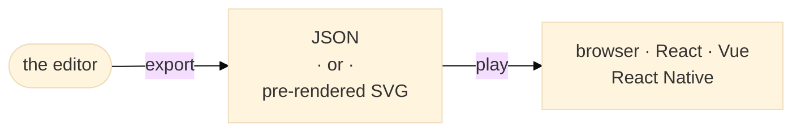
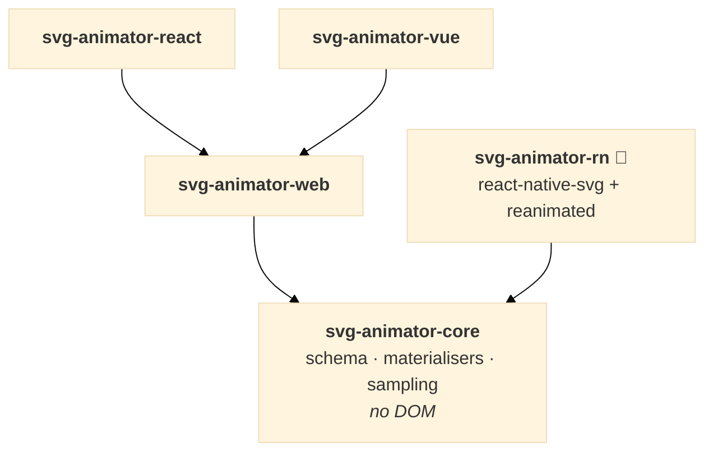

# Introduction

[← Contents](./README.md) · Next: [Choosing a format →](./02-start--choosing-a-format.md)

Pixodesk SVG Animator is three things that work together:

| Piece | What it is | Where |
|---|---|---|
| **The editor** | A vector & animation editor — draw or import **SVG** or **Lottie**, animate it on a timeline, export | [pixodesk.com](https://pixodesk.com) (*Pixodesk Animator Studio* desktop app Windows/Mac) |
| **The file formats** | A **JSON** document (elements + animation data) or a **pre-rendered SVG** — a normal `.svg` carrying the animation as pure **CSS keyframes** (no JavaScript at all) or as embedded **JS** running the player, on the WAAPI or frames engine | Written by the editor, read by the players and by browsers |
| **The players** | Small open-source runtime libraries that play the JSON on the web, in React, Vue and React Native | [this repository](../README.md), MIT-licensed, on npm as `@pixodesk/svg-animator-*` |

## What it's good for

- Splash screens
- Animated backgrounds
- Icon animations
- Loaders
- Illustrations that react to hover, click or scroll
- Animated logos

Anything you would otherwise reach for a GIF, a video or a Lottie file for — but as crisp,
tiny, scalable SVG.

## The two formats, in one paragraph each

**JSON** is the source format: a small document describing the SVG tree plus its
animation. A player library renders it and gives you complete runtime control — play, pause,
seek, reverse, speed — and supports every animation type on every browser. It is the right
choice for apps (React / Vue / React Native), for complex animations, and whenever you need to
drive the animation from code.

**Pre-rendered SVG** is a normal `.svg` file with the animation baked in. Drop it into any
page, CMS or static-site generator and it plays — no library needed for the CSS flavour. It is
the simplest option and the right one for most icons, loaders and decorative animation.

Both come out of the same editor document, and the editor converts between them at any time.
[Choosing a format](./02-start--choosing-a-format.md) has the decision table.

## Which package do I need?

| You are building… | Use | Install |
|---|---|---|
| A plain HTML page, or you just want to drop a file in | a **pre-rendered SVG** — no package at all | — |
| A page with vanilla JavaScript, and you want runtime control | JSON + the **web player** | `@pixodesk/svg-animator-web` |
| A React / Next.js app | JSON + the **React component** | `@pixodesk/svg-animator-react` |
| A Vue / Nuxt app | JSON + the **Vue component** | `@pixodesk/svg-animator-vue` |
| A React Native / Expo app | JSON + the **React Native component** 🧪 | `@pixodesk/svg-animator-rn` |
| Tooling that validates, transforms or samples documents without rendering | the **core** | `@pixodesk/svg-animator-core` |

The React and Vue packages wrap the web player; every player shares the core, so the same
document produces the same frames everywhere.

## Where next

- Deciding on a format → [Choosing a format](./02-start--choosing-a-format.md)
- Want to understand the file → [JSON format reference](./14-format--json-format.md) or the two-page [Format principles](./13-format--format-principles.md)

[← Contents](./README.md) · Next: [Choosing a format →](./02-start--choosing-a-format.md)
